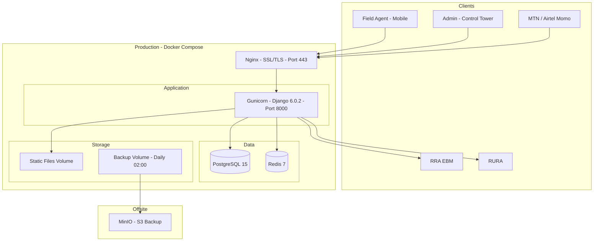
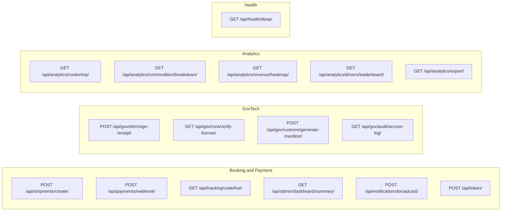
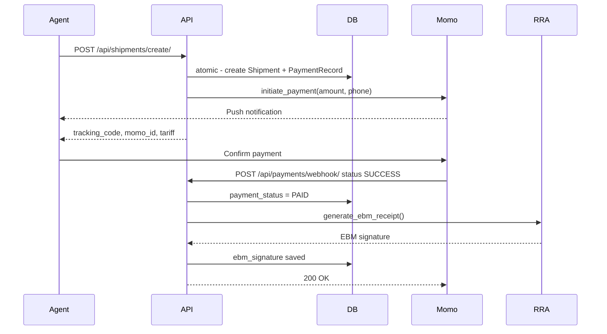
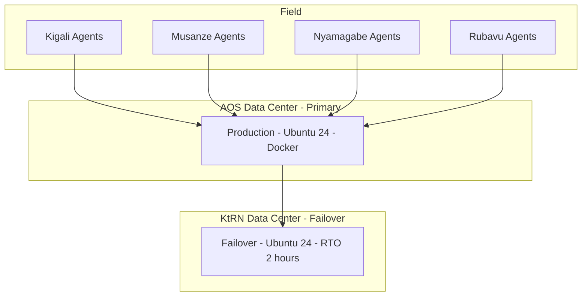

# IshemaLink System Architecture

## Container Architecture

```mermaid
graph TB
    subgraph Clients
        AGENT[Field Agent - Mobile]
        ADMIN[Admin - Control Tower]
        MOMO[MTN / Airtel Momo]
        RRA[RRA EBM]
        RURA[RURA]
    end

    subgraph Production - Docker Compose
        NGINX[Nginx - SSL/TLS - Port 443]

        subgraph Application
            GUNICORN[Gunicorn - Django 6.0.2 - Port 8000]
        end

        subgraph Data
            POSTGRES[(PostgreSQL 15)]
            REDIS[(Redis 7)]
        end

        subgraph Storage
            STATIC[Static Files Volume]
            BACKUP[Backup Volume - Daily 02:00]
        end
    end

    subgraph Offsite
        MINIO[MinIO - S3 Backup]
    end

    AGENT --> NGINX
    ADMIN --> NGINX
    MOMO --> NGINX
    NGINX --> GUNICORN
    GUNICORN --> POSTGRES
    GUNICORN --> REDIS
    GUNICORN --> RRA
    GUNICORN --> RURA
    BACKUP --> MINIO
    GUNICORN --> STATIC
```

---

## API Endpoints

```mermaid
graph LR
    subgraph Booking and Payment
        A[POST /api/shipments/create/]
        B[POST /api/payments/webhook/]
        C[GET /api/tracking/code/live/]
        D[GET /api/admin/dashboard/summary/]
        E[POST /api/notifications/broadcast/]
        F[POST /api/token/]
    end

    subgraph GovTech
        G[POST /api/gov/ebm/sign-receipt/]
        H[GET /api/gov/rura/verify-license/]
        I[POST /api/gov/customs/generate-manifest/]
        J[GET /api/gov/audit/access-log/]
    end

    subgraph Analytics
        K[GET /api/analytics/routes/top/]
        L[GET /api/analytics/commodities/breakdown/]
        M[GET /api/analytics/revenue/heatmap/]
        N[GET /api/analytics/drivers/leaderboard/]
        O[GET /api/analytics/export/]
    end

    subgraph Health
        P[GET /api/health/deep/]
    end
```

---

## Booking and Payment Flow

```mermaid
sequenceDiagram
    participant Agent
    participant API
    participant DB
    participant Momo
    participant RRA

    Agent->>API: POST /api/shipments/create/
    API->>DB: atomic - create Shipment + PaymentRecord
    API->>Momo: initiate_payment(amount, phone)
    Momo-->>Agent: Push notification
    API-->>Agent: tracking_code, momo_id, tariff

    Agent->>Momo: Confirm payment
    Momo->>API: POST /api/payments/webhook/ status SUCCESS
    API->>DB: payment_status = PAID
    API->>RRA: generate_ebm_receipt()
    RRA-->>API: EBM signature
    API->>DB: ebm_signature saved
    API-->>Momo: 200 OK
```

---

## Rwanda Deployment

```mermaid
graph TB
    subgraph AOS Data Center - Primary
        PROD[Production - Ubuntu 24 - Docker]
    end

    subgraph KtRN Data Center - Failover
        FAILOVER[Failover - Ubuntu 24 - RTO 2 hours]
    end

    subgraph Field
        KIGALI[Kigali Agents]
        MUSANZE[Musanze Agents]
        NYAMAGABE[Nyamagabe Agents]
        RUBAVU[Rubavu Agents]
    end

    KIGALI --> PROD
    MUSANZE --> PROD
    NYAMAGABE --> PROD
    RUBAVU --> PROD
    PROD --> FAILOVER
```
